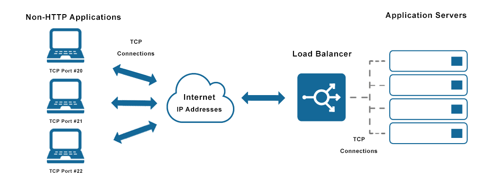
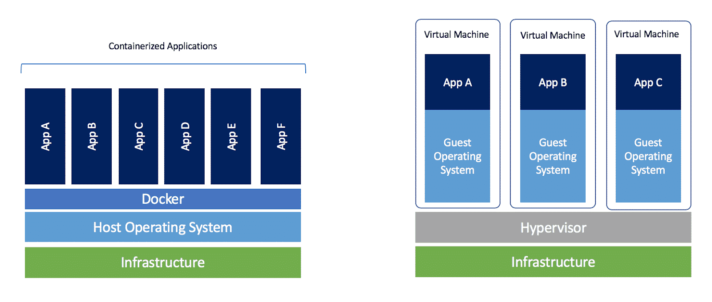
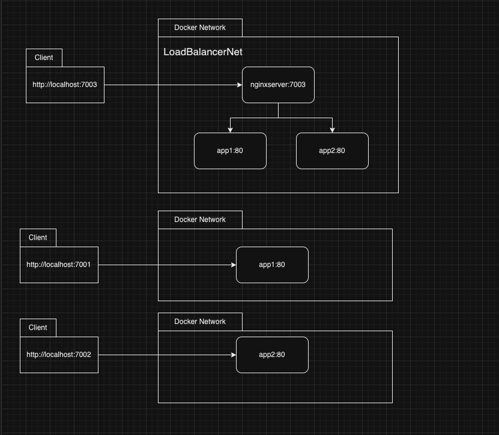

##
# Application of Nginx Load Balancer with Docker Compose
***Hello, everyone! I want to talk about Nginx and Docker. I'll talk about creating a load balancer with Nginx on Docker. I'll write about implementation so If you have any problems with load balancer, nginx, docker etc. you can click the links under the text.***

**This file in my [Github](https://github.com/ruchany13/MyDockerExamples/tree/main/Nginx-LoadBalancer)**

## Load Balancer

 A load balancer acts as the “traffic cop” sitting in front of your servers and routing client requests across all servers capable of fulfilling those requests in a manner that maximizes speed and capacity utilization and ensures that no one server is overworked, which could degrade performance. If a single server goes down, the load balancer redirects traffic to the remaining online servers. When a new server is added to the server group, the load balancer automatically starts to send requests to it.
 You can find a lot of detail about load balancer in this [link](https://www.nginx.com/resources/glossary/load-balancing/).



## Nginx
 NGINX is open source software for web serving, reverse proxying, caching, load balancing, media streaming, and more. It started out as a web server designed for maximum performance and stability. In addition to its HTTP server capabilities, NGINX can also function as a proxy server for email (IMAP, POP3, and SMTP) and a reverse proxy and load balancer for HTTP, TCP, and UDP servers.
 You can find a lot of detail about Nginx in this [link](https://www.nginx.com/resources/glossary/nginx/).

## Docker 
 Docker is an open platform for developing, shipping, and running applications. Docker enables you to separate your applications from your infrastructure so you can deliver software quickly. With Docker, you can manage your infrastructure in the same ways you manage your applications. By taking advantage of Docker’s methodologies for shipping, testing, and deploying code quickly, you can significantly reduce the delay between writing code and running it in production.
 You can find a lot of detail about Nginx in this [link](https://docs.docker.com/get-started/overview/).

 
 
# Requirements
 Now, we'll need some apps for implementation. You can install on your pc with links. I'm using MacOs.

- **Docker** is main part of this article. You can click [link](https://docs.docker.com/engine/) for installation.
- **Text Editor**, I'm using Visual Studio Code on MacOS but in linux server you can use vim or nano. If you have GUI, you can use Visual Studio. You can click [link](https://code.visualstudio.com/download) for Visual studio code installation

# Implementation
Yes, we can start writing a little bit of code, and a config file. It’ll be funny:)
 
If you are ready, we can start. The load balancer separates requests from each server. We will create two servers for load balancing. Every server includes different index.html file so we can check which app is responding. The name of servers `app1` and `app2`. And we will create an Nginx file for load balancer configuration. We will run on Docker with a `docker-compose.yml` file.

 File system:
``` title="Folder Tree"
--- NginxLB
  +-- docker-compose.yml
  +-- nginx
    --- Dockerfile
    --- nginx.conf
    
  +-- app1
      --- Dockerfile
      --- index.html
      
  +-- app2
      --- Dockerfile
      --- index.html
```

I'm doing on MacOS on terminal also can run Linux Terminal same codes:

```bash
mkdir NginxLB
cd NginxLB
touch docker-compose.yml
mkdir nginx
mkdir app1
mkdir app2
```

## Create Nginx Config

We'll create a config file in the nginx directory. This config file includes how Nginx work and which ports.

```yaml title="nginx/nginx.conf"
http {
    upstream loadbalancer {
      server app1:80;
      server app2:80;
    }
  
    server {
      location / {
        proxy_pass http://loadbalancer;
      }
    }
  }
  
  events { }

```

We'll create a docker network for containers in Docker Compose. In Docker, containers can found each other with `container name` like we'll use `app1 , app2` or you can give `hostname` parameter. So, `nginxserver` container can access other nginx apps with hostname and port 80 internal. It is good for production, because you don't need open any ports from application container.

We'll run a website on the main server. Main server Dockerfile:

```Dockerfile title="nginx/Dockerfile"
FROM nginx

COPY nginx.conf /etc/nginx/nginx.conf

```

Now, we can write our changes in docker-compose.yml:
```yaml title="docker-compose.yaml"
version: '3'

services:
  nginxserver:
    build: ./nginx
    ports:
      - "7003:80"
    depends_on:
      - app1
      - app2
    networks:
      - LoadBalancerNet
```
The services include our docker containers. The first container is main server.
- **nginxserver** is the name of the main server container. We run the website on this server.

- **ports** include which ports we use. Nginx exposes 80 ports for requests. We'll use port 7003 to connect 80 ports in nginx.

- **depends_on** meaning this service depends on these services for running. They don't run, this service doesn't run.
- **LoadBalancerNet** is network for communicate containers each other with container name and internal ports. 

Next, we'll create our server app1 and app2.

## App1 and App2

Firstly, we'll create a Dockerfile for app1 in the app1 file. You can copy this file app2.

```Dockerfile title="app1/Dockerfile app2/Dockerfile"
FROM nginx

COPY ./index.html /usr/share/nginx/html/index.html
```
Dockerfiles are the same with app1 and app2. But, `index.html` files are different. 

```html title="app1/index.html"
<html>
     <div style="text-align: center;"> 
         <h3>Welcome to My Website</h3>
         <p>app1 server respond </p>
     </div>
 </html>
```

```html title="app2/index.html"
<html>
     <div style="text-align: center;"> 
         <h3>Welcome to My Website</h3>
         <p>app2 server respond </p>
     </div>
 </html>
```
Okay, we created an Html page. Which server responds to our request to write in Html. So we can check our systems. Now, we can add our servers in docker-compose.yml.

```yaml
  app1:
    build: ./app1
    ports:
      - "7001:80"
    networks:
      - LoadBalancerNet

  app2:
    build: ./app2
    ports:
      - "7002:80"
    networks:
      - LoadBalancerNet
```
We created services for each server. We define ports to apps for access apps without load balancer.It isn't neceseaary for Load Balancer. Main server (Loadbalancer) use docker network interface for access app's 80 ports. Default Nginx Server ports is 80.

Lastly *docker-compose.yml*:

```yaml title="docker-compose.yml"
version: '3'

services:
  nginxserver:
    build: ./nginx
    ports:
      - "7003:80"
    depends_on:
      - app1
      - app2
    networks:
      - LoadBalancerNet

  app1:
    build: ./app1
    ports:
      - "7001:80"
    networks:
      - LoadBalancerNet

  app2:
    build: ./app2
    ports:
      - "7002:80"
    networks:
      - LoadBalancerNet
networks:
  LoadBalancerNet:
```

## Diagram of Network
You can see how load balancer works in first client request `http://localhost:7003`. And can see how we connect directly apps with ports in other requests.



## Build and Run
Now, the last step is building compose file and run on our localhost.

You have to same directory with `docker-compose.yml`
We will run the `docker-compose` file. Docker build services with Dockerfiles we created.

This command creates, builds and runs services. That is very easy. Yes with one command!

```bash
docker-compose up
```
Let's check our *localhost:7003* and see which server responds. That is. Very easy and useful. 


Last hint: You can use with *-d* parameters for use terminal. It'll work back at the terminal.

```bash
docker-compose up -d
```

Thank you for reading:)
