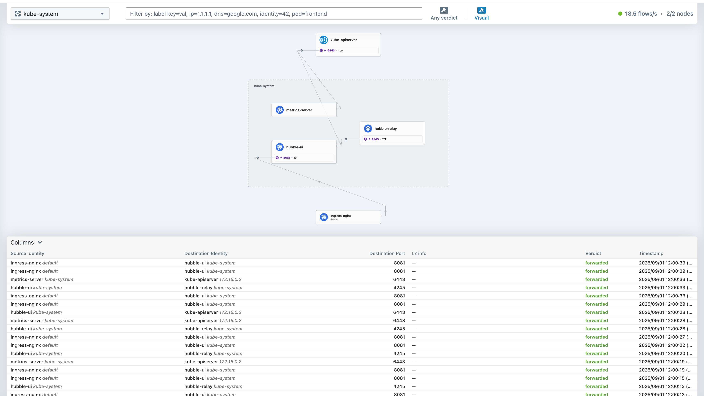
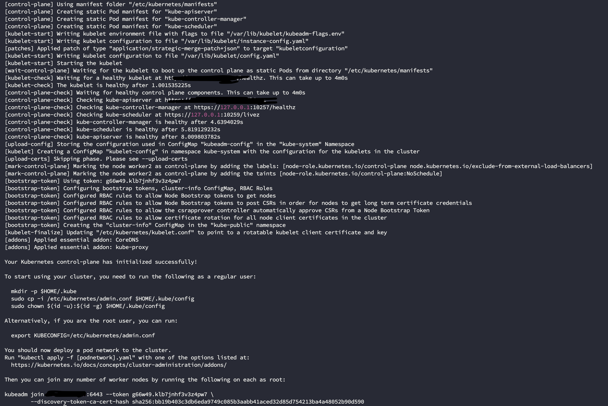
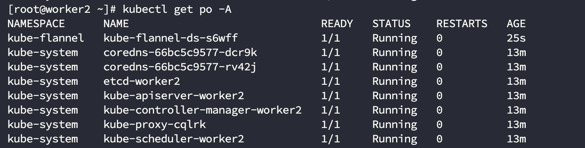
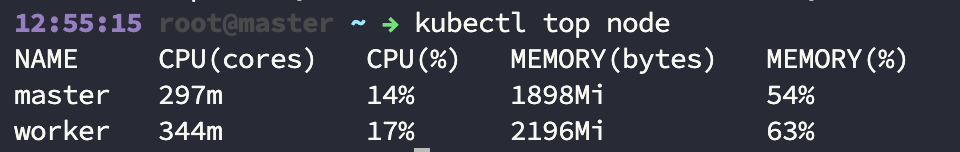

Hello! I'll explain Vanilla Kubernetes Instalation with kubeadm tool. I setup simple Kubernetes Cluster for lab enviorement with 1 master and 2 worker. You can add more master or worker in the cluster. If you setup Production Ready cluster, you can look other blogs because of production best-practies. My advice; If you want setup production cluster, firstly create a lab enviroment.

## What Is Kubeadm

Kubeadm is a tool built to provide kubeadm init and kubeadm join as best-practice "fast paths" for creating Kubernetes clusters.

kubeadm performs the actions necessary to get a minimum viable cluster up and running. By design, it cares only about bootstrapping, not about provisioning machines. Likewise, installing various nice-to-have addons, like the Kubernetes Dashboard, monitoring solutions, and cloud-specific addons, is not in scope.

Instead, we expect higher-level and more tailored tooling to be built on top of kubeadm, and ideally, using kubeadm as the basis of all deployments will make it easier to create conformant clusters.(1)

## Why Kubeadm ?

I tried other Kubernetes tools (k3s, rancher, minikube) in lab and production enviorement. Generally, I choose kubeadm from other tools for lab and especially production enviorement. I prefer because:

- It is lightweight, so there is not extra component like storage class, ingress controller etc.
- I have total control of my cluster. It is also advantage and disadvantage. I can control cluster and use newest Kubernetes vesion without any support waiting on my tool. But, you have to setup components like ingress controller, storage class, helm etc. 
- It has huge community support, so if you have problem you can reach anybody.
- You can learn Kubernetes architecture more than others. Because I said " you have total control and you have to setup components like ingress controller, storage class, helm etc."

## My Enviorement
I have 3 servers from Hetzner (cx22). I choose Hetzner because of low prices unless good quality. I paid 4.99 dolar every server. If you sign up with this [[link](https://hetzner.cloud/?ref=5NqQSVWeZ49P)] Hetzner will give you $20 dolar, and if you spend 10 dolar expect free ,I'll take 10 dollar. So this link is for you :) . *This is not commercial*:

- 1 Control Plane, 2 Worker Nodes
- **OS:** Rocky Linux 9 (others can be used like Rocky 10)
- **CPU:** 2 VCPU
- **RAM:** 4 GB
- **Disk:** 40 GB

You can use ubuntu or others. But I have some problems in ubuntu like 'kubernetes nameservers error' . So I'm using rocky like procution  and lab environments. Also, In my locaiton (Turkey) generally companies using Rhel or Rocky Linux.

For **memory and ram**. It is enough for simple Kubernetes cluster tests and  applications. You can increase resources or add more worker.

## Prepare Servers
!!! warning "Warning"
    You have to apply steps until **Kubeadm Init** both control-plane and worker servers. After this step there is different instructions for every server type.


### Pre-Checks
Firstly, you have uniq mac adress and hostname on the servers. You can check with this commands:
```bash title="Hostname Check"
hostnamectl
hostname
```
```bash title="Mac and IP adress Check"
ifconfig
ip link show
```
### Setup Firewall Rules

**Control Plane**

| Protocol | Direction | Port Range  | Purpose                   | Used By                  |
|----------|-----------|-------------|---------------------------|--------------------------|
| TCP      | Inbound   | 6443        | Kubernetes API server     | All                      |
| TCP      | Inbound   | 2379-2380   | etcd server client API    | kube-apiserver, etcd     |
| TCP      | Inbound   | 10250       | Kubelet API               | Self, Control plane      |
| TCP      | Inbound   | 10259       | kube-scheduler            | Self                     |
| TCP      | Inbound   | 10257       | kube-controller-manager   | Self                     |

**Worker Nodes**

| Protocol | Direction | Port Range  | Purpose             | Used By              |
|----------|-----------|-------------|---------------------|----------------------|
| TCP      | Inbound   | 10250       | Kubelet API         | Self, Control plane  |
| TCP      | Inbound   | 10256       | kube-proxy          | Self, Load balancers |
| TCP      | Inbound   | 30000-32767 | NodePort Services†  | All                  |
| UDP      | Inbound   | 30000-32767 | NodePort Services†  | All                  |


### Disable Swap
Kubernetes don't use swap space and you have to remove swap. Firstly, isable swap this command temporarily when machine is reboot:

```bash title="Disable Swap"
swapoff -a
```
Now, remove and swap entity in to the `etc/fstab` file for disable swap space disable when machine rebot.

### Disable Selinux
We diable Selinux or you can configure. We disable selinux because required to allow containers to access the host filesystem; for example, some cluster network plugins require that. You have to do this until SELinux support is improved in the kubelet.

You can use on disable or permissive mode. I prefer disable mode. You can change `SELINUX=disable` to `SELINUX=permissive`. About selinux [click link.](https://www.redhat.com/en/topics/linux/what-is-selinux)

```bash title="Disable Selinux"
sudo setenforce 0
sudo sed -i 's/^SELINUX=permissive$/SELINUX=disabled/' /etc/selinux/config
```

### Activate Kernel Modules
We will activate 2 kernel module for Kubernetes. *Overlay* and *br_netfiltier*.

```bash title="Setup Kernel Modules"
modprobe overlay
modprobe br_netfilter
```

We will create new file on `/etc/sysctl.d/` like `k8s.conf`. Add these to new file:

```bash title="/etc/sysctl.d/k8s.conf"
net.bridge.bridge-nf-call-ip6tables = 1
net.bridge.bridge-nf-call-iptables = 1
net.ipv4.ip_forward = 1
```

After that, you can run command `sudo sysctl -p /etc/sysctl.d/k8s.conf`and activate it.

### Setup Container Runtime
You can choose many container runtime in Kubernetes. Container runtimes work for manage containers in pods. You can check other supported CRI [link.](https://kubernetes.io/docs/setup/production-environment/container-runtimes/) . I'll choose **Containerd**.

```bash title="Setup Containerd"
sudo dnf -y install dnf-plugins-core
sudo dnf config-manager --add-repo https://download.docker.com/linux/rhel/docker-ce.repo
sudo dnf install containerd.io
sudo systemctl enable --now containerd
sudo systemctl start containerd
```

After setup, we will activate Cgroups on the Containerd wih this commands:
```bash title="Activate Cgroup"
containerd config default | tee /etc/containerd/config.toml
sed -i 's/            SystemdCgroup = false/            SystemdCgroup = true/' /etc/containerd/config.toml
systemctl restart containerd
```

### Kubeadm, Kubelet, Kubectl Installation
I explained what is kubeadm so:

- **Kubectl:** Kubectl is a tool for communicates with Kubernetes Cluster .We will create, update, delete Kubernetes objects with Kubectl commands.
- **Kubelet:** Kubelet is a agent work on every node in cluster. It provides pod heathy on nodes. It apply order from API Server.

Other components like Api Server we mentioned will setup with Kubeadm.

You can install with this commands. I'll chose Kubernetes 1.34 version:

```bash title="Update Yum Repo"
cat <<EOF | sudo tee /etc/yum.repos.d/kubernetes.repo
[kubernetes]
name=Kubernetes
baseurl=https://pkgs.k8s.io/core:/stable:/v1.34/rpm/
enabled=1
gpgcheck=1
gpgkey=https://pkgs.k8s.io/core:/stable:/v1.34/rpm/repodata/repomd.xml.key
exclude=kubelet kubeadm kubectl cri-tools kubernetes-cni
EOF
```

```bash title="Install kubelet, kubeadm and kubectl"
sudo yum install -y kubelet kubeadm kubectl --disableexcludes=kubernetes
```

## Create Kubernetes Cluster with Kubeadm

### Kubeadm Init on Control Plane

!!! Warning
    This step is for control plane.

After prepare servers and installl required components we can start kubeadm with `kubeadm init`command on the cluster. We have some parameter options for kubeadm command:

- **control-plane-endpoint:** This parameter used for Control Plane. Other nodes will use this parameter for access Kubernetes Control Plane. This is recomenned for HA Kubernetes cluster (like 3 master nodes).
- **--apiserver-advertise-address:** The IP address the API Server will advertise it's listening on. If not set the default network interface will be used. You can give control-plane node IP adress.
- **--pod-network-cidr:** Specify range of IP addresses for the pod network. If set, the control plane will automatically allocate CIDRs for every node.
This parameter setup IP range for CNI. CNI is setup communication between kubernetes objects (pods,nodes ...). I'll use Flannel for simple but I prefer **cilium** for learning Kubernetes Network deeply and Hubble feature. With hubble you can track network on you cluster with schema.

<figure markdown="span">
  { width="500" }
  <figcaption>Hubble UI</figcaption>
</figure>

```bash title="Kubeadm Init"
kubeadm init --apiserver-advertise-address=<node_ip> --pod-network-cidr=10.244.0.0/16
```

After succesfully init on master node, you will see output like. 

<figure markdown="span">
  { width="700" }
  <figcaption>Kubeadm Inıt on Control-Plane</figcaption>
</figure>

We will use these section for add worker node below steps:

```bash
Then you can join any number of worker nodes by running the following on each as root:

kubeadm join <node-ip>:6443 --token g66w49.klb7jnhf3v3z4pw7 \
        --discovery-token-ca-cert-hash sha256:bb19b403c3db6eda9749c085b3aabb41aced32d85d754213ba4a48052b90d590
```

Export 'kubeconfig' file for access Kubectl to cluster. You can add root and other users on control-plane node.

=== "Root User"
    Run this command, after that add your shell file (.bashrc, .zshrc etc.) 
    ```bash
    export KUBECONFIG=/etc/kubernetes/admin.conf
    ```

=== "User"
    
    ```bash
    mkdir -p $HOME/.kube
    sudo cp -i /etc/kubernetes/admin.conf $HOME/.kube/config
    sudo chown $(id -u):$(id -g) $HOME/.kube/config
    ```
### Add Worker Node

!!! Warning
    This step is for worker nodes. Apply every worker nodes in sequently.

We created the Kubernetes cluster control-plane node. Now, we will add workers to Kubernetes clusters with command copy on the Kubeadm init output. If you lose, you can re-create token with:

```bash title="Re-create Kubeadm Join Command"
kubeadm token create --print-join-command
```

After that, run this command in every worker node. You will see nodes with `kubectl get nodes` on the control-plane node. The nodes will be not ready because of flannel not added.

### Install Flannel

!!! Warning
    We will run this `kubectl`commands on the control-plane node. Because we don't transfer kubeconfig file to other nodes, so we can't access `kubectl`. In the below steps, we will acccess from all nodes.

Install Flannel latest version to cluster with this command:

```bash title="Install Flannel"
kubectl apply -f https://github.com/flannel-io/flannel/releases/latest/download/kube-flannel.yml
```
You can see the all pods are ready and running in cluster with `kubectl get pods -A`. After every pod ready, you will see all nodes be ready:

<figure markdown="span">
  { width="700" }
  <figcaption>Ready Pods</figcaption>
</figure>

!!! success
    Now, we have a Kubernetes cluster with control-plane and 2 worker nodes. After that, you can run your applications.

## Post Install Advices

### Run Kubectl on the Workers

You can run `kubectl`on the control-plane and it is enough. But If you want to access from workers. 

- Copy `/etc/kubernetes/admin.conf`for root or from regular user `$HOME/.kube/config` from control-plane node to worker nodes. Apply the steps when we run `kubeadm init` command:

=== "Root User"
    Run this command, after that add your shell file (.bashrc, .zshrc etc.) 
    ```bash
    export KUBECONFIG=/etc/kubernetes/admin.conf
    ```

=== "User"
    
    ```bash
    mkdir -p $HOME/.kube
    sudo cp -i /etc/kubernetes/admin.conf $HOME/.kube/config
    sudo chown $(id -u):$(id -g) $HOME/.kube/config
    ```

### Add metric server

With metric server, monitor cluster nodes and pods like these:

<figure markdown="span">
  { width="700" }
  <figcaption>Kubeadm Metric Server</figcaption>
</figure>

Run this command install Metric Server:

```bash title="Install Metric Server"
kubectl apply -f https://github.com/kubernetes-sigs/metrics-server/releases/latest/download/components.yaml
```

If take error `error: Metrics API not available`, you can run this workaorund on [link.](https://medium.com/@cloudspinx/fix-error-metrics-api-not-available-in-kubernetes-aa10766e1c2f)

> Thank you for reading, this document created by a human. 