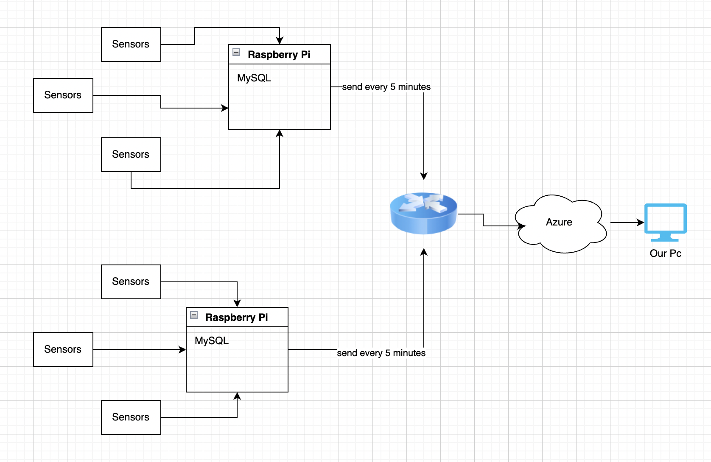

# Distributed Smart City Application Using Kubernetes on Edge Devices

## Project Overview

This project aims to explore the use of edge computing and cloud computing systems in a hybrid configuration for smart city applications. Specifically, air quality measurement was carried out using Raspberry Pi devices placed at designated points within the Yalova University campus. These devices collected temperature and humidity data, which was processed in a distributed manner and then sent to the cloud for further analysis.

The main objective of the project is to reduce energy consumption, minimize the requirement for high bandwidth, and create a more efficient system for data processing. The developed system is modular and scalable, allowing the addition of new nodes to monitor the entire city in the future.

## Technologies Used

- **Raspberry Pi 4**: Used as edge devices, equipped with temperature and humidity sensors.
- **Docker and Kubernetes**: Docker was used for application containerization and Kubernetes for managing container orchestration and scaling.
- **K3S and KubeEdge**: These were deployed separately to manage Kubernetes on edge devices, and their performance was compared.
- **Microsoft Azure**: Used as the cloud environment, with data being sent from Raspberry Pi devices via REST APIs.
- **Django**: Developed a web application for users to monitor air quality data in real-time.
- **Ganglia**: Used for monitoring energy consumption and performance both on edge devices and the cloud.

## Project Structure

### 1. System Architecture

The project utilizes a hybrid architecture that incorporates both edge and cloud computing elements. Docker containers running on edge devices collect data from sensors, which is then processed locally and periodically sent to the cloud. This setup reduces both bandwidth usage and energy consumption.

#### **Edge Devices and Their Role**

- **Hardware**: Two Raspberry Pi 4 devices were used, each equipped with DHT11 temperature and humidity sensors.
- **Data Collection**: Data was collected in real-time from these sensors, and edge processing was carried out to filter and aggregate this information before sending it to the cloud. 
- **Local Processing**: Each Raspberry Pi collected and pre-processed data, taking the average over a specific interval (e.g., every 5 minutes) before transmitting it to reduce data volume.

#### **Cloud Integration**

- **Microsoft Azure**: Azure was selected as the cloud provider for hosting the backend services due to its scalability and accessibility for university students.
- **Data Transfer**: Data was sent from edge devices to the cloud using REST APIs implemented with Django, ensuring secure and efficient data transfer.
- **Web Interface**: A Django-based web application was developed to allow users to visualize the air quality data in real time, including historical data through graphical representations.

### 2. Software and Tools Used

- **Docker**: Docker was used to containerize the applications running on edge devices. Containers helped in isolating the applications and ensured consistent performance across all devices.
- **Kubernetes**: Kubernetes was used for managing and orchestrating the containers both on the edge devices and in the cloud.
  - **K3S**: A lightweight Kubernetes distribution designed for edge environments. It was used to deploy and manage containers on Raspberry Pi devices.
  - **KubeEdge**: Another lightweight Kubernetes distribution designed specifically for extending Kubernetes capabilities to edge devices. Both K3S and KubeEdge were tested and their performance was compared in terms of energy consumption and response times.

- **Ganglia**: An open-source monitoring tool was used to track system metrics like energy usage, data transfer rates, and overall application performance. This tool was installed on both the edge devices and the cloud environment, and data was visualized through Azure's integrated monitoring solutions.

### 3. Deployment Steps

1. **Setting Up Edge Devices**:
   - **Hardware Preparation**: Two Raspberry Pi 4 devices were prepared, and DHT11 sensors for temperature and humidity measurement were connected.
   - **Software Installation**: Linux was installed on Raspberry Pi devices, followed by Docker and Python for running data collection and processing scripts.
   - **Container Deployment**: The data collection and processing applications were containerized using Docker and deployed on Raspberry Pi devices.

2. **Cloud Integration**:
   - **REST API Development**: A REST API was developed using Django to facilitate secure data transfer from edge devices to the cloud.
   - **Azure Integration**: The collected data was transmitted to Microsoft Azure's database. Azure was chosen because of its compatibility with university accounts, allowing free and easy access for students.
   - **Web Application Deployment**: A Django-based web interface was deployed on Azure to display real-time and historical air quality data.

3. **Kubernetes on Edge Devices**:
   - **K3S and KubeEdge Installation**: Both K3S and KubeEdge were installed separately on Raspberry Pi devices. These systems provided Kubernetes orchestration capabilities, enabling the automatic scaling and management of Docker containers on edge devices.
   - **Performance Testing**: The performance of K3S and KubeEdge was monitored using Ganglia, focusing on metrics such as energy consumption, latency, and resource utilization.

### 4. Monitoring and Evaluation

The performance of the edge-cloud hybrid system was monitored in real-time using Ganglia. Key metrics such as energy consumption, data transmission rates, and system resource usage were tracked. These metrics were visualized through a web-based dashboard to understand the efficiency of the system and identify areas for improvement.

- **Performance Comparison**: Both K3S and KubeEdge were evaluated based on their efficiency in managing the edge nodes. The main criteria included energy consumption, data processing speed, and ease of deployment.
- **Ganglia Integration**: Ganglia was used to monitor the Raspberry Pi edge devices and the cloud infrastructure simultaneously, providing insights into the system's overall health and performance.

## Results and Impact

- **Energy Efficiency**: By processing data locally at the edge, the system significantly reduced the amount of data that needed to be sent to the cloud, resulting in lower energy consumption.
- **Bandwidth Optimization**: Sending aggregated data to the cloud every 5 minutes instead of transmitting raw data continuously helped to optimize bandwidth usage.
- **Scalability**: The system was designed to be modular, making it easy to add more sensors and edge devices to cover larger areas, such as an entire city.
- **Academic Contribution**: The findings of this project will be presented as a conference paper, contributing valuable insights to the academic community regarding the use of edge computing in smart city applications.

## Conclusion

The project demonstrated the potential of using a hybrid edge-cloud architecture for smart city applications, particularly for air quality monitoring. By leveraging Kubernetes on edge devices through lightweight solutions like K3S and KubeEdge, the project achieved a scalable, energy-efficient, and cost-effective solution.

The insights from this project could serve as a reference for researchers and developers interested in deploying similar solutions for smart city applications. Future work may include expanding the project to incorporate other types of sensors and using advanced data analytics for improved decision-making.

## GitHub Repository

You can find the project source code on GitHub: [IOT Air Quality Project](https://github.com/ruchany13/IOTAirQualityProject)

